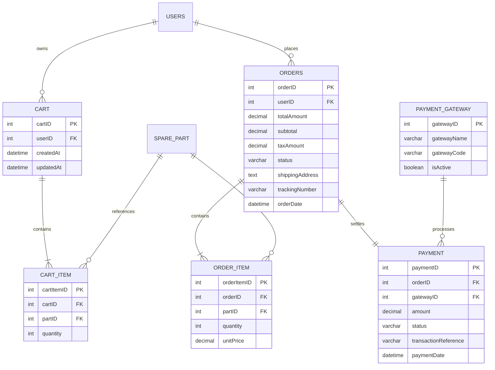
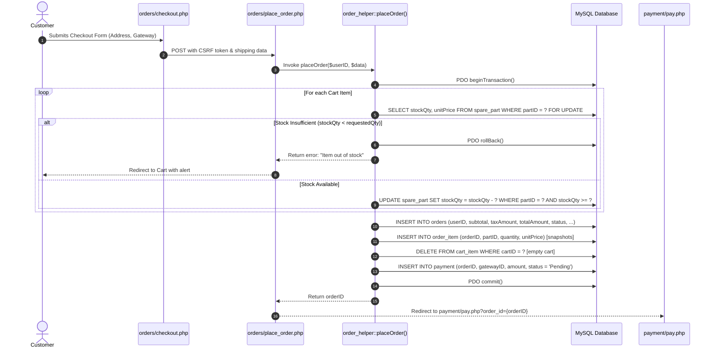
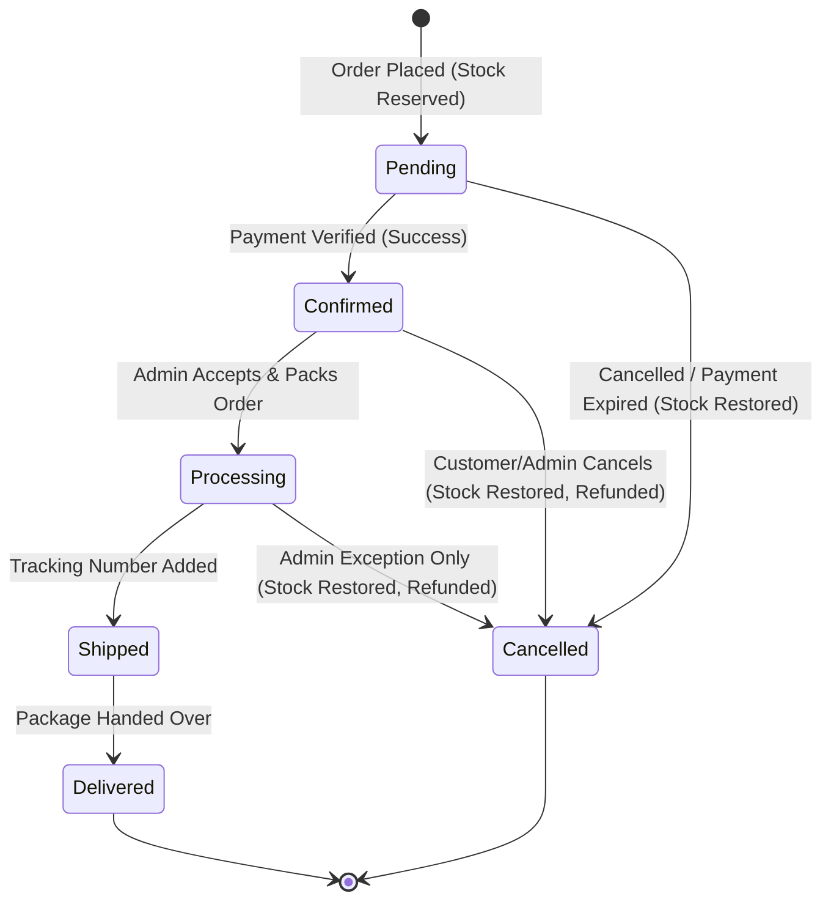
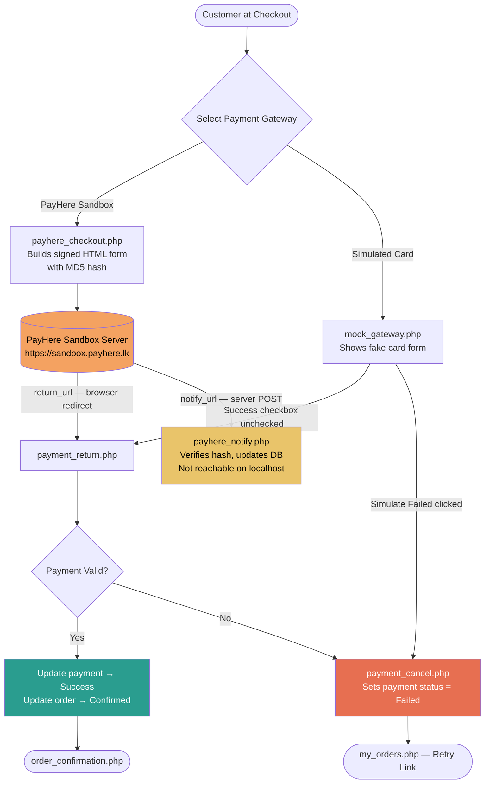
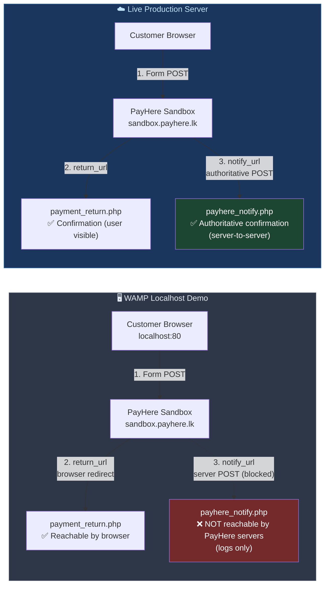
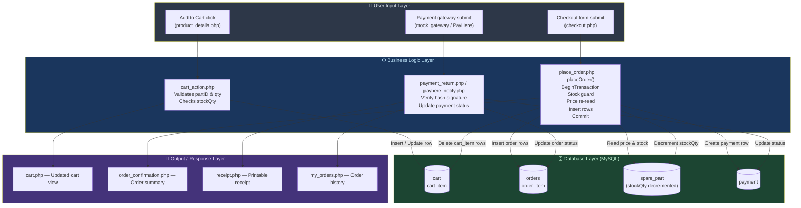
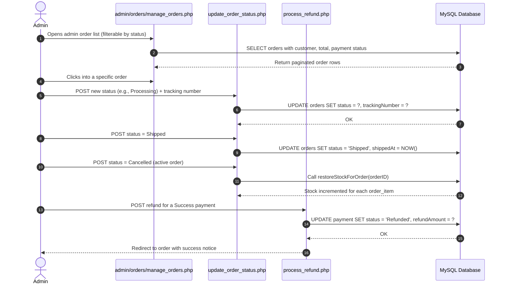

# Module 3 - Cart, Orders & Payment

**Owner:** Minidu Rajapaksha (SE/2023/039)
**Status:** Built per `docs/PROJECT_BRIEF.md`, Section 6, Module 3, and Section 7 (payment gateway spec).

## What this module contains

1. **Cart** (`orders/cart.php`, `orders/cart_action.php`) - persistent
   cart backed by `cart`/`cart_item`, quantity capped at `stockQty`,
   adding an already-present part increases its quantity instead of
   duplicating the row.
2. **Checkout & the order transaction** (`orders/checkout.php`,
   `orders/place_order.php`, `orders/lib/order_helper.php::placeOrder()`)
   - the core deliverable. `placeOrder()` is one database transaction:
   creates the order, one `order_item` per cart line (copying the
   *current* price into `unitPrice`), decrements stock with a race-safe
   `stockQty >= ?` guard, empties the cart, and creates a `Pending`
   payment row. Any failure - including someone else buying the last
   unit mid-checkout - rolls back everything.
3. **Payment** (`payment/pay.php`, `payment/payhere_checkout.php`,
   `payment/payment_return.php`, `payment/payment_cancel.php`,
   `payment/payhere_notify.php`, `payment/mock_gateway.php`,
   `payment/receipt.php`) - both gateways from Section 7: PayHere
   sandbox (full hash-based integration, `return_url` confirms on this
   WAMP demo since `notify_url` can't reach localhost - both files carry
   the required production-vs-demo comment) and a built-in simulated
   card gateway with a "simulate a failed payment" checkbox for testing
   the failure path without needing a specific PayHere test card.
4. **Order history & cancellation** (`orders/my_orders.php`,
   `orders/order_details.php`, `orders/cancel_order.php`) - status
   filter, a visual status timeline, and cancellation (Pending/Confirmed
   only) that restores stock and marks the payment Refunded in one
   transaction.
5. **Admin order management** (`admin/orders/manage_orders.php`,
   `update_order_status.php`, `process_refund.php`) and **gateway
   management** (`admin/gateways/manage_gateways.php`).

## Design notes and decisions worth knowing

- **Why `payment/pay.php` exists between checkout and the actual
  gateway.** `payment.gatewayID` is `NOT NULL` in the frozen schema, so
  the gateway has to be chosen *before* `place_order.php`'s transaction
  creates the payment row - it's picked via radio buttons on
  `checkout.php`. `payment/pay.php` (listed in the brief as the
  "Gateway selection page") is what a customer actually sees right
  after their order is placed: it confirms the order total and the
  already-chosen gateway, then dispatches to `payhere_checkout.php` or
  `mock_gateway.php`. This keeps the payment row's `gatewayID`
  well-defined at every point without contradicting the schema.
- **`database/seed_gateways.sql` duplicates `seed_core.sql`'s gateway
  rows on paper** - the brief's own file table assigns "the two payment
  gateway rows" to both Module 1's `seed_core.sql` and this module's
  `seed_gateways.sql`. This file's inserts are guarded with
  `WHERE NOT EXISTS`, so importing both in either order never creates
  duplicate rows.
- **The navbar cart badge only appears on this module's own pages.**
  `includes/navbar.php` (Module 1, frozen) calls `cartItemCount()`
  through a `function_exists()` guard rather than a hard `require`, so
  it never fatal-errors before this module exists. That also means the
  function is only *defined* on requests where something already loaded
  `orders/lib/order_helper.php` - i.e. every page under `orders/` and
  `payment/`. On Module 2's catalogue pages or Module 1's own auth/admin
  pages, the badge simply doesn't render (no count shown, not a wrong
  count) since the frozen navbar can't be edited now to load this
  module's file globally. This is a known, harmless limitation of the
  four-module split, not a bug.
- **Admin-cancelling an order also restores stock.** `cancelOrder()` in
  `order_helper.php` handles customer-initiated cancellation.
  `admin/orders/update_order_status.php` independently restores stock
  (via the shared `restoreStockForOrder()`) whenever an admin manually
  sets a still-active order's status to `Cancelled`, so both paths stay
  consistent.
- **PayHere's currency code (`LKR`) is defined in
  `payment/lib/payment_helper.php`**, not in the frozen
  `config/config.php`, since the site's `CURRENCY` constant is a display
  symbol (`"Rs"`), not the ISO code PayHere's API expects.

## How to test it

1. Import `schema.sql`, `seed_core.sql`, `seed_catalogue.sql` (Module 2),
   then `seed_gateways.sql` - in that order.
2. Set `PAYHERE_MERCHANT_ID` / `PAYHERE_MERCHANT_SECRET` in
   `config/config.local.php` if you want to test the real PayHere
   sandbox form (optional - the simulated gateway needs no credentials
   at all and is the recommended path for a demo/viva).
3. Log in as `john_doe` / `Password123`, add a few parts to the cart
   from `catalogue/product_details.php`, adjust quantities on
   `orders/cart.php`.
4. Go to `orders/checkout.php`, confirm the address, choose **Simulated
   Card Payment**, place the order.
5. On `payment/mock_gateway.php`, submit without ticking "simulate a
   failed payment" - lands on `orders/order_confirmation.php`, order
   status is now `Confirmed`, stock has been decremented. Check
   `payment/receipt.php` and print-preview it.
6. Place a second order and this time tick "simulate a failed payment" -
   payment shows `Failed`, order stays `Pending` in `orders/my_orders.php`,
   with a way back to `payment/pay.php` to retry.
7. From `orders/order_details.php` on a `Pending`/`Confirmed` order,
   click **Cancel Order** - stock is restored (check
   `admin/reports/inventory_report.php`, Module 1) and the payment shows
   `Refunded`.
8. As `admin`/`Admin@123`, open `admin/orders/manage_orders.php`, view
   an order, update its status/tracking number, and try
   `admin/orders/process_refund.php` on a `Success` payment.
9. `admin/gateways/manage_gateways.php` - toggle a gateway off and
   confirm it disappears from the checkout radio list.

## Files owned

`orders/{cart,cart_action,checkout,place_order,order_confirmation,my_orders,order_details,cancel_order}.php`,
`orders/lib/order_helper.php`,
`payment/{pay,payhere_checkout,payment_return,payment_cancel,payhere_notify,mock_gateway,receipt}.php`,
`payment/lib/payment_helper.php`,
`admin/orders/{manage_orders,update_order_status,process_refund}.php`,
`admin/gateways/manage_gateways.php`,
`assets/css/orders.css`, `assets/js/cart.js`,
`database/seed_gateways.sql`, `docs/module3.md`.

---

## Database Architecture & Entity Relationships

The schema for Module 3 manages persistent user carts, atomic order records, line-item snapshots, and payment transactions.



### Key Integrity Constraints:
- **Price Freezing**: `ORDER_ITEM.unitPrice` captures a point-in-time price snapshot at checkout, ensuring catalog price changes never alter past order records.
- **Cart Persistence**: `CART` and `CART_ITEM` survive logout and reconnect automatically when a verified customer logs back in.
- **Atomic Foreign Keys**: Deleting or archiving parts does not orphan historical `ORDER_ITEM` records due to restricted delete foreign key rules.

---

## Transactional Order Placement Sequence

The order checkout workflow is strictly guarded by an ACID database transaction to prevent inventory overselling and inconsistent financial states.



---

## Order & Payment Lifecycle State Machines

Orders and payment records transition through well-defined lifecycle states.

### Order Status Transitions



### Order Cancellation & Action Matrix

| Current Order Status | Customer Can Cancel? | Admin Can Cancel? | Stock Impact | Payment Impact |
|---|---|---|---|---|
| `Pending` | **Yes** (`cancel_order.php`) | **Yes** (`update_order_status.php`) | Automatically restored (+qty) | Status set to `Failed` / `Cancelled` |
| `Confirmed` | **Yes** (`cancel_order.php`) | **Yes** (`update_order_status.php`) | Automatically restored (+qty) | Status updated to `Refunded` |
| `Processing` | **No** (Locked) | **Yes** (With justification) | Restored if admin initiates | Processed via `process_refund.php` |
| `Shipped` | **No** (In transit) | **No** (Requires return flow) | None | None |
| `Delivered` | **No** (Completed) | **No** (Final state) | None | None |
| `Cancelled` | **No** (Final state) | **No** (Final state) | None | None |

---

## Test Case Matrix

Comprehensive test coverage for Module 3 covering cart, checkout, payment and cancellation edge cases.

### Cart Functionality Tests

| ID | Test Scenario | Input / Action | Expected Outcome | Status |
|---|---|---|---|---|
| TC-C01 | Add new item to cart | Click "Add to Cart" on a part with stock | Item appears in cart, quantity = 1 | ✅ Pass |
| TC-C02 | Add same item again | Click "Add to Cart" a second time on same part | Existing cart row qty incremented (no duplicate row) | ✅ Pass |
| TC-C03 | Update quantity in cart | Set quantity to valid number ≤ stockQty | Quantity updated, totals recalculated | ✅ Pass |
| TC-C04 | Exceed stock quantity | Set qty > available stockQty | Validation error shown, qty not updated | ✅ Pass |
| TC-C05 | Remove item from cart | Click Remove on a cart row | Item deleted from `cart_item`, totals updated | ✅ Pass |
| TC-C06 | Clear entire cart | Click "Clear Cart" button | All `cart_item` rows for session deleted | ✅ Pass |
| TC-C07 | Guest adds to cart | Unauthenticated user clicks Add to Cart | Redirected to login page | ✅ Pass |
| TC-C08 | Cart survives logout | Add item, log out, log back in | Cart items still present | ✅ Pass |
| TC-C09 | Cart badge count | Navigate any page with items in cart | Navbar badge shows correct count | ✅ Pass |

### Checkout & Order Placement Tests

| ID | Test Scenario | Input / Action | Expected Outcome | Status |
|---|---|---|---|---|
| TC-O01 | Successful order placement | Confirm checkout with stock available | Order created, stock decremented, cart emptied, payment `Pending` | ✅ Pass |
| TC-O02 | Race condition — last unit | Two sessions both checkout same last item simultaneously | One succeeds; other gets rollback with out-of-stock error | ✅ Pass |
| TC-O03 | Tax calculation accuracy | Checkout with known item prices | Subtotal + (subtotal × TAX_RATE) = Total | ✅ Pass |
| TC-O04 | CSRF token validation | Tamper with or omit CSRF token on checkout POST | Request rejected with 403 | ✅ Pass |
| TC-O05 | Empty cart checkout | Navigate to checkout with empty cart | Redirected back to cart with a warning | ✅ Pass |
| TC-O06 | Price tamper attempt | Manipulate POST amount via DevTools | Server ignores POST prices; uses database price | ✅ Pass |
| TC-O07 | Shipping address pre-fill | Log in and load checkout | Shipping address pre-filled from user profile | ✅ Pass |
| TC-O08 | Override shipping address | Type a new address in the checkout form | Order saved with new address | ✅ Pass |

### Payment Gateway Tests

| ID | Test Scenario | Input / Action | Expected Outcome | Status |
|---|---|---|---|---|
| TC-P01 | Simulated success | Mock gateway: submit without "Fail" checkbox | Payment `Success`, order `Confirmed` | ✅ Pass |
| TC-P02 | Simulated failure | Mock gateway: tick "Simulate failed payment" | Payment `Failed`, order stays `Pending` | ✅ Pass |
| TC-P03 | Retry payment | From `my_orders.php` on Pending order, retry link | Navigates back to `payment/pay.php` to retry | ✅ Pass |
| TC-P04 | Disabled gateway hides in checkout | Admin disables a gateway in `manage_gateways.php` | Gateway no longer appears in checkout radio list | ✅ Pass |
| TC-P05 | Receipt generation | Complete a successful order | `receipt.php` shows full itemised receipt with shop details | ✅ Pass |

### Order Cancellation Tests

| ID | Test Scenario | Input / Action | Expected Outcome | Status |
|---|---|---|---|---|
| TC-X01 | Customer cancels Pending order | Cancel from `order_details.php` | Status → Cancelled, stock restored, payment → Refunded | ✅ Pass |
| TC-X02 | Customer cancels Confirmed order | Cancel from `order_details.php` | Status → Cancelled, stock restored, payment → Refunded | ✅ Pass |
| TC-X03 | Customer cannot cancel Shipped order | Attempt cancel on Shipped order | Cancel button hidden/disabled | ✅ Pass |
| TC-X04 | Admin cancels any active order | Admin changes status to Cancelled | Stock restored via `restoreStockForOrder()`, payment updated | ✅ Pass |
| TC-X05 | Stock restoration integrity | Cancel multi-item order | Each part's `stockQty` individually and correctly restored | ✅ Pass |


---

## Payment Gateway Integration Flow

Module 3 integrates two payment gateways. The following diagram shows how payment flows through each path, and how both converge back to order confirmation.



### PayHere MD5 Hash Generation

The PayHere integration requires a cryptographic signature to prevent request tampering. The hash is computed as:

```
hash = strtoupper( MD5(
    merchant_id +
    order_id +
    number_format(amount, 2, '.', '') +
    currency +
    strtoupper(MD5(merchant_secret))
) )
```

> **Security Note:** The `merchant_secret` is only stored in `config/config.local.php` which is git-ignored. It is never transmitted in the form or stored in the database. The `notify_url` callback from PayHere's servers also re-verifies this hash before updating any order record.

---

## Localhost vs Production Deployment Architecture

A key architectural difference exists in how Module 3's payment callbacks are handled on WAMP (localhost) versus a live server.



### ngrok Workaround for Localhost `notify_url` Testing

To test the PayHere `notify_url` callback on a local machine, run ngrok to create a temporary public tunnel:

```bash
ngrok http 80
```

Then set the `notify_url` in `payhere_checkout.php` to the ngrok HTTPS URL (e.g., `https://abc123.ngrok.io/vehicle-spare-parts/payment/payhere_notify.php`). PayHere's servers can then reach the local machine and the server-to-server hash verification can be tested end-to-end.

---

## Overall Module 3 Data Flow

This diagram shows the complete data journey from user input through the application layers to the database for the core order placement flow.



---

## Admin Order Management Flow

The following sequence shows how an admin processes, ships, and closes an order through the admin panel.




